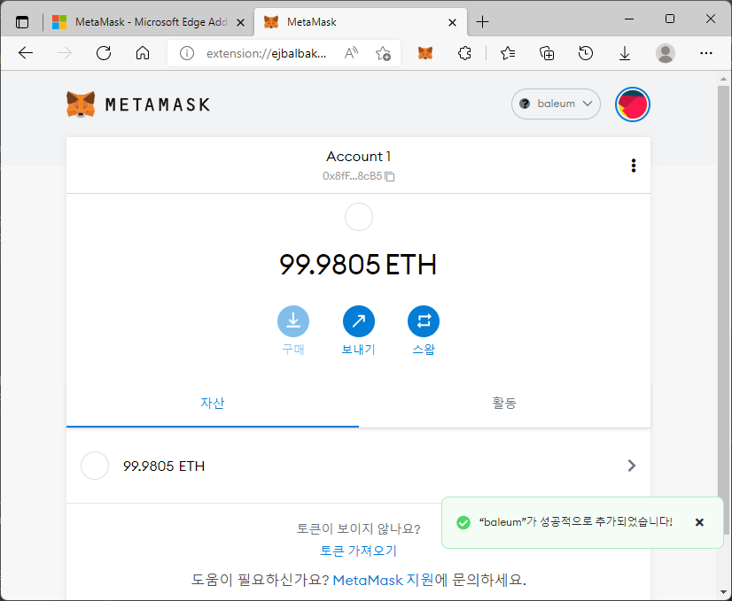
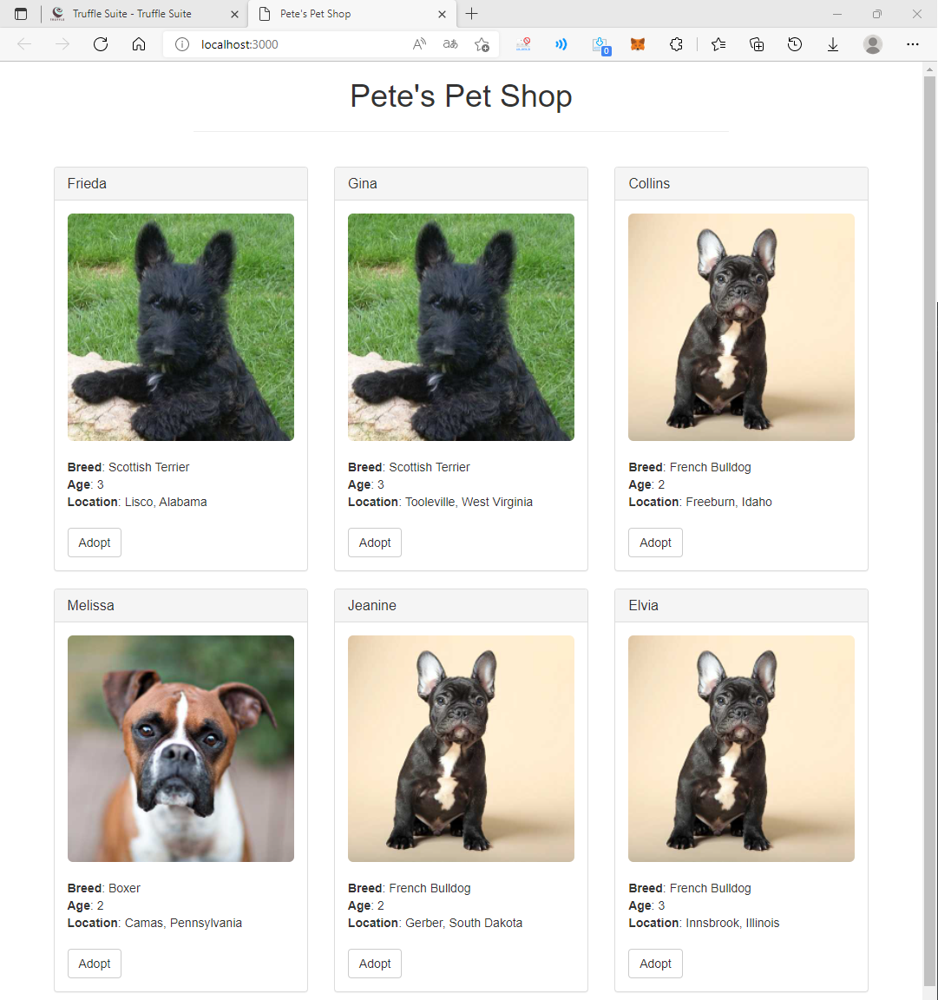
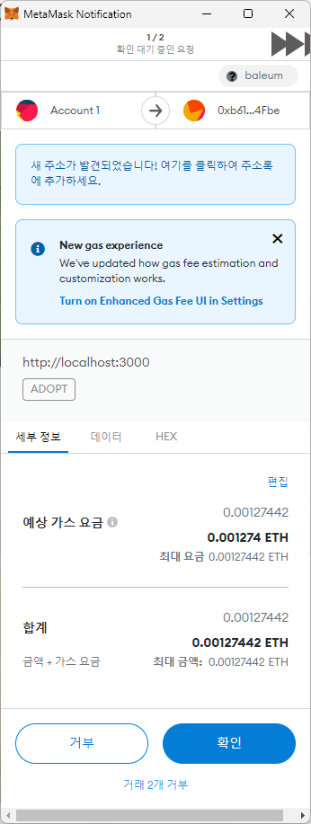
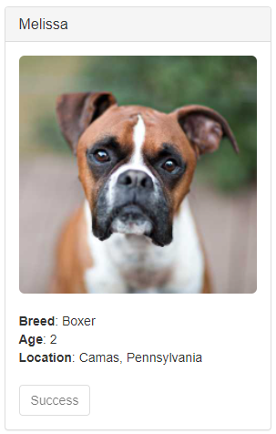

# Pet Shop 튜토리얼


[가이드](https://trufflesuite.com/guides/pet-shop/index.html) 를 따라가며 진행하는 튜토리얼

첫번째 dApp으로 펫샵 입양 추적 시스템을 만들어 보자.

## 배경

상점에는 한 번에 최대 16마리를 수용할 수 있으며 펫 데이터베이스를 보유하고 있다.  
상점은 이더리움 주소를 입양할 애완동물과 연결하는 dApp을 원한다.

## 개발 환경 세팅

node.js와 git, ganache 설치가 필요하다.

```bash
npm install -g truffle
```

## Truffle box로 Truffle 프로젝트 만들기

```bash
mkdir pet-shop-tutorial
cd pet-shop-tutorial
```

```bash
truffle unbox pet-shop
```

### 디렉토리 구조

* contracts: 스마트 컨트랙트용 솔리디티 소스 파일 디렉토리
* migrations: 스마트 컨트랙트 배포를 위한 마이그레이션 시스템, 마이그레이션은 변경 사항을 추적할 수 있는 특수한 스마트 계약이다.
* test: 스마트 컨트랙트에 대한 자바스크립트와 솔리디티 테스트
* truffle-config.js: Truffle 설정 파일

## 스마트 컨트랙트 작성하기

1. `/contracts` 디렉토리를 생성하고 `Adiotion.sol` 파일을 만들자.
2. 파일을 아래와 같이 작성한다.

```solidity
pragma solidity ^0.5.0;

contract Adoption {

}
```

3. adopters 변수를 추가해보자.

```solidity
address[16] public adopters;
```

### 첫번째 함수: 펫 입양하기

1. 위에서 작성한 변수 선언 다음에 아래 함수를 추가하자. 이 함수는 스마트 컨츠랙트롤 사용될 것이다.

```solidity
function adopt(uint petId) public returns (uint) {
    require(0 <= petId && petId <= 15);
    // require 조건 확인
    adopters[petId] = msg.sender;
    // 이 함수 실행하는 사람이나 스마트 컨트랙트는 msg.sender
    return petId;
}
```

### 두번째 함수: 입양자 검색하기

array getter는 주어진 키에 대해 한가지 값만 반환할 수 있다.  
UI는 모든 입양 상태를 고려해야 하므로 array 전체를 반환하는 함수가 필요하다.

1. 스마트 컨트랙트에 getAdopters() 함수를 추가해보자.

```solidity
function getAdopters() public view returns (address[16] memory) {
    return adopters;
}
```

## 스마트 컨트랙트 컴파일 및 마이그레이션

### 컴파일

솔리디티는 컴파일이 필요한 언어이다. EVM(이더리움 가상 머신)에서 실행하기 위해 바이트 코드로 솔리디티 코드를 컴파일해야한다.

1. root 디렉토리에서 아래 명령을 입력해보자.

```bash
truffle compile
```

아래와 같은 출력이 나올 것이다.

```bash
Compiling your contracts...
===========================
> Compiling .\contracts\Adoption.sol
> Compiling .\contracts\Migrations.sol
> Artifacts written to D:\develop\project\pet-shop-tutorial\build\contracts
> Compiled successfully using:
   - solc: 0.5.16+commit.9c3226ce.Emscripten.clang
```

### 마이그레이션

스마트 컨트랙트 컴파일이 성공적으로 완료되었으므로 블록체인에 마이그레이션할 시간입니다!  
마이그레이션은 한 상태에서 다른 상태로 이동하여, 어플리케이션 컨트랙트의 상태를 변경하는 것을 의미하는 스크립트를 배포합니다. 첫번째 마이그레이션에서는 새 코드를 배포할 수 있습니다. 그러나 이미 배포된 경우라면
다른 마이그레이션에서 데이터를 이동하거나 계약을 새로운 계약으로 교체할 수 있습니다.

`migrations` 디렉토리에는 `1_initial_migration.js` 파일이 있습니다. 이 파일은 다음 스마트 컨트랙트 마이그레이션을 관찰하기 위해 `Migrations.sol` 계약을 배포하고 향후
변경되지 않은 계약을 중복해서 마이그레이션하지 않도록 합니다.

그렇다면 우리만의 마이그레이션 스크립트를 작성해보시죠!

1. `migrations`디렉토리에 `2_deploy_contracts.js` 파일을 새로 만들자.
2. 아래 코드를 파일에 작성하자.

```javascript
const Adoption = artifacts.require("Adoption");

module.exports = (deployer) => {
    deployer.deploy(Adoption);
};
```

3. 계약을 블록체인으로 마이그레이션하기 전에 블록체인을 실행해야 한다. Ganache를 이용하여 이더리움 개발용 개인 블록체인을 만들고 계약 배포, 어플리케이션 개발, 테스트를 실행하는데 사용하자.
4. 터미널에서 계약을 블록체인으로 마이그레이션하자.

```bash
truffle migrate 
```

아래와 같은 결과가 출력될 것이다.

```bash
1_initial_migration.js
======================

   Deploying 'Migrations'
   ----------------------
   > transaction hash:    0xdb78ebb96ad6fd5ed9dd19d8fa5e2bcd55a937e949b449b09179833c27b975d1
   > Blocks: 0            Seconds: 0
   > contract address:    0xA47a6D846E957f8eb43F01b89F217ABa1DbbD0Cc
   > block number:        1
   > block timestamp:     1649158663
   > account:             0x8fF0792d265281edCD05766a43150F5291148cB5
   > balance:             99.99616114
   > gas used:            191943 (0x2edc7)
   > gas price:           20 gwei
   > value sent:          0 ETH
   > total cost:          0.00383886 ETH

   > Saving migration to chain.
   > Saving artifacts
   -------------------------------------
   > Total cost:          0.00383886 ETH


2_deploy_contracts.js
=====================

   Deploying 'Adoption'
   --------------------
   > transaction hash:    0x04963f826495c5fd54e7388c0c54c7ada7ede8814ded7e15ce6f1f1dc68a0891
   > Blocks: 0            Seconds: 0
   > contract address:    0xb612C1Bd368fBcDfbb06C8265F92190f3e9C4Fbe
   > block number:        3
   > block timestamp:     1649158664
   > account:             0x8fF0792d265281edCD05766a43150F5291148cB5
   > balance:             99.99123376
   > gas used:            204031 (0x31cff)
   > gas price:           20 gwei
   > value sent:          0 ETH
   > total cost:          0.00408062 ETH

   > Saving migration to chain.
   > Saving artifacts
   -------------------------------------
   > Total cost:          0.00408062 ETH

Summary
=======
> Total deployments:   2
> Final cost:          0.00791948 ETH
```

> 마이그레이션이 순서대로 실행되고 관련 정보가 함께 출력되는 것을 확인할 수 있다.

가나슈에서 블록체인 상태가 바뀐 것을 확인할 수 있다. 현재 블록이 0에서 4로 변경되고 첫번째 계정의 이더가 마이그레이션 거래 비용 때문에 감소한 것을 확인할 수 있다.

지금까지 첫번째 스마트 계약을 작성하고 로컬 블록체인에 배포해 보았다. 이제부터는 우리가 원하는대로 작동하는지 작성한 스마트 계약과 상호작용 해보자!  
트러플은 솔리디티와 자바스크립트 모두 테스트에 사용할 수 있다. 먼저 솔리디티로 테스트하는 방법을 살펴보고 자바스크립트를 사용하여 테스트해본다.

## 솔리디티로 스마트 컨트랙트 테스트하기

1. `test` 디렉토리에 `TestAdoption.sol` 파일을 추가하자.
2. `TestAdoption.sol` 파일에 아래 코드를 추가하자.

```solidity
pragma solidity ^0.5.0;

import "truffle/Assert.sol";
import "truffle/DeployedAddresses.sol";
import "../contracts/Adoption.sol";

contract TestAdoption {
    // 테스트할 입양 계약의 주소
    Adoption adoption = Adoption(DeployedAddresses.Adoption());

    // 테스트에 사용될 펫의 ID
    uint expectedPetId = 8;

    // 입양된 펫의 소유자로 기대되는 사람은 바로 이 계약자
    address expectedAdopter = address(this);

}
```

3개를 import하여 계약을 시작해보려 한다.

- `Assert.sol`: 테스트에 사용할 어설션이 있다. 테스트에서는 어설션이 동등성, 허점을 확인하여 통과 여부를 확인한다.
- `DeployedAddresses.sol`: 테스틀르 진행할 때, 트러플은 블록체인에 테스트될 계약의 새로운 인스턴스를 배포할 것이다. 스마트 계약은 배포된 계약 주소를 갖는다.
- `Adoption`: 테스트하고 싶은 스마트 계약

3개의 계약 전역 변수를 정의해보자.

- 먼저 테스트할 스마트 계약을 포함하기 위해 `DeployedAddresses` 스마트 계약을 호출하여 주소를 가져온다.
- 다음으로 입양 기능을 테스트할 펫의 ID를 가져온다.
- 마지막으로 `TestAdoption` 계약이 트랜잭션을 보낼 것이다. 예상 어댑터 주소는 `this`로 설정한다. 다시 말해, 현재 계약의 주소를 가져오는 계약 전역 변수로 설정한다.

### adopt() 함수 테스트하기

`adopt()` 함수 테스트를 위해 성공시에 함수가 무엇을 반환하는지를 살펴보자.
`adopt()` 함수는 `petId`를 반환한다는 사실을 기억하자. 우리는 `adopt()`의 반환값이 전달한 id와 일치하는지 확인하여 올바르게 작동하였는지 검증할 수 있다.

1. 아래 함수를 `TestAdoption.sol` 스마트 컨트랙트에 추가하자.

```solidity
// adopt() 함수 테스트하기
    function testUserCanAdoptPet() public {
        uint returnedId = adoption.adopt(expectedPetId);
        Assert.equal(returnedId, expectedPetId, "예상되는 펫의 ID와 입양 결과가 일치해야 함!");
    }
```

> 앞에서 만든 TestAdoption 계약 내부에 삽입해야 한다.

- 앞에서 선언한 Adoption 스마트 계약을 expectedPetId로 호출한다.
- 마지막으로 실제 값(결과)과 예상 값, 실패 메시지를 `Assert.equal()`에 전달한다.

### 특정 펫의 소유자 검색 테스트

솔리디티의 public 변수는 자동적으로 getter 메소드를 갖는다. 우리는 위의 입양 테스트로 인해 저장되는 주소를 검색할 수 있다. 저장된 데이터는 테스트 기간 동안 유지되므로 위에서 입양된
펫의 `expectedId`는 다른 테스트에서 검색할 수 있다.

1. 아래 함수를 `TestAdoption.sol`에 추가하자.

```solidity
// 특정 펫의 소유자 검색하여 테스트
    function testGetAdopterAddressByPetId() public {
        address adopter = adoption.adopters(expectedPetId);
        Assert.equal(adopter, expectedAdopter, "해당 펫의 소유자는 이 계약이어야 함!");
    }
```

입양 계약에 저장되어 있는 펫의 입양자 주소를 받은 뒤 위에서처럼 동등성을 확인한다.

### 모든 펫의 소유자 검색 테스트

배열은 특정 키에 대한 단일 값만을 반환할 수 있으므로 전체 배열에 대한 자체 getter(`getAdopters()`)를 만들었었다.

1. `TestAdoption.sol`에 아래 함수를 추가한다.

```solidity
// 모든 펫의 소유자 검색하여 테스트
    function testGetAdopterAddressByPetIdInArray() public {
        // 계약의 저장소가 아닌 메모리에 저장
        address [16] memory adopters = adoption.getAdopters();
        Assert.equal(adopters[expectedPetId], expectedAdopter, "해당 펫의 소유자는 이 계약이어야 함!");
    }
```

`adopters`의 **memory** 속성을 잘 기억하자. 메모리 속성은 솔리디티가 값을 계약의 저장소에 저장하지 않고 메모리에 임시로 저장하도록 지시한다.
`adopters`는 배열이며 첫번째 테스트에서 `petId`를 테스트해서 입양된 펫의 ID와 일치한다는 사실을 알고 있기 때문에 배열에서 해당 ID의 위치에 계약의 주소가 지정되어 있는지를 비교해보면 된다.

## 자바스크립트로 스마트 컨트랙트 테스트

1. `testAdoption.test.js` 파일을 `test` 디렉토리에 생성하자.
2. 파일에 아래 코드를 작성한다.

```javascript
const Adoption = artifacts.require("Adoption");

contract("Adoption", (accounts) => {
    let adoption;
    let expectedPetId;

    before(async () => {
        adoption = await Adoption.deployed();
    });

    describe("펫을 입양하고 계정의 주소를 검색함", async () => {
        before("accounts[0]가 펫을 입양", async () => {
            await adoption.adopt(8, {from: accounts[0]});
            expectedAdopter = accounts[0];
        });
    });
});
```

우리는 다음을 가져와서 계약을 시작한다.

- `Adoption`: 테스트하고 싶은 스마트 계약, `Adoption` 컨트랙트를 `artifacts.require`를 사용하여 import한다.

테스트를 작성할 때, `accounts`를 인자로 받는 콜백 함수를 작성한다. 이를 통해 테스트 중 네트워크에서 사용되는 계정을 제공받는다.

다음으로 `before`를 사용하여 아래에 대한 초기 설정을 제공한다.

- 8번 id를 통해 펫을 입양한다. 네트워크의 테스트 계정 중 첫번째 계정에 할당된다.
- 이 함수는 나중에 `accounts[0]`에서 petId가 8이 맞는지 확인할 때 사용된다.

### adopt() 함수 테스트

`adopt` 함수를 테스트하기 위해 성공시에는 해당되는 입양자를 반환한다는 사실을 떠올려보자. 우리는 주어진 petID에 기반하여 입양자를 확인할 수 있다. petID는 `adopt` 함수내에서
expectedAdopter와 비교할 수 있다.

1. 아래 코드를 `testAdoption.test.js` 테스트 파일에 추가하자.

```javascript
it("펫 id로 소유자의 주소를 가져올 수 있다.", async () => {
    const adopter = await adoption.adopters(8);
    assert.equal(adopter, expectedAdopter, "첫번째 계정이 소유자여야 함!");
});
```

> 코드는 before 코드 블록 다음에 추가해야한다.

- 스마트 컨트랙트 메소드 `adopters`를 호출하여 어떤 주소가 petID 8번의 펫을 입양했는지 본다.
- 트러플은 assert 함수를 사용하도록 `Chai`를 import한다. 실제 값, 예상 값, 실패 메시지를 `assert.equal()`에 전달한다.

### 모든 펫 소유자를 검색하여 테스트

배열은 하나의 키에 대해 하나의 값만 반환할 수 있으므로 전체 배열을 반환하는 getter를 새로 만들었었다.

1. 아래 함수를 `testAdoption.test.js` 파일에 추가한다.

```javascript
it("모든 펫 소유자의 주소를 가져올 수 있다.", async () => {
    const adopters = await adoption.getAdopters();
    assert.equal(adopters[8], expectedAdopter, "컬렉션에 입양된 펫의 소유가자 있어야 함!");
});
```

> 코드는 이전 단계에서 작성한 it 코드 블록 다음에 추가하면 된다.

adopters는 배열이고 우리는 첫번째 테스트에서 petId가 8인 펫을 입양했다는 사실을 알고 있기 때문에 계약의 주소와 찾길 기대하는 주소를 비교하고 있다.

## 테스트 실행

1. 터미널로 돌아가서 테스트를 실행해보자.

```bash
truffle test
```

> 가나슈를 실행한 상태에서 실행해야 한다.

2. 테스트가 종료되면 아래와 같이 표시되는 것을 확인할 수 있다!

```bash
Using network 'development'.


Compiling your contracts...
===========================
> Compiling .\contracts\Adoption.sol
> Compiling .\contracts\Migrations.sol
> Compiling .\test\TestAdoption.sol
> Compiling truffle\Assert.sol
> Compiling truffle\AssertAddress.sol
> Compiling truffle\AssertAddressArray.sol
> Compiling truffle\AssertBalance.sol
> Compiling truffle\AssertBool.sol
> Compiling truffle\AssertBytes32.sol
> Compiling truffle\AssertBytes32Array.sol
> Compiling truffle\AssertGeneral.sol
> Compiling truffle\AssertInt.sol
> Compiling truffle\AssertIntArray.sol
> Compiling truffle\AssertString.sol
> Compiling truffle\AssertUint.sol
> Compiling truffle\AssertUintArray.sol
> Compiling truffle\DeployedAddresses.sol
> Artifacts written to C:\Users\fabi8\AppData\Local\Temp\test--2772-1nuilNm0ntUS
> Compiled successfully using:
   - solc: 0.5.16+commit.9c3226ce.Emscripten.clang


  TestAdoption
    √ testUserCanAdoptPet (507ms)
    √ testGetAdopterAddressByPetId (456ms)
    √ testGetAdopterAddressByPetIdInArray (509ms)

  Contract: Adoption
    펫을 입양하고 계정의 주소를 검색함
      √ 펫 id로 소유자의 주소를 가져올 수 있다. (179ms)
      √ 모든 펫 소유자의 주소를 가져올 수 있다. (110ms)


  5 passing (16s)
```

## 스마트 컨트랙트와 상호작용하는 UI 만들기

지금까지 스마트 계약을 만들고, 로컬 테스트 블록체인에 배포하고 콘솔을 통해 상호작용해보았다. 이제 펫 샵을 운영할 수 있도록 UI를 만들 차례이다.

`pet-shop` 트러플 박스에는 이미 프로트엔드 코드의 일부가 포함되어있다. 해당 코드는 `src` 폴더에 위치한다.

처음 시작하는 만큼 웹팩 같은 빌드 시스템을 사용하지 않고 프로트 엔드를 구성하였다. 앱의 구조는 모두 갖추어져 있다. 우리는 이더리움과 관련된 코드만 채워넣을 예정이다. 이러한 방식을 이용하여 프론트 엔드 개발시에
배운 내용을 활용할 수 있을 것이다.

### web3 인스턴스화

1. 에디터로 `/src/js/app.js` 파일을 열자.
2. 파일을 살펴보자. 우리 어플리케이션을 관리하고 init()으로 펫 데이터를 로드한 다음 initWeb3() 함수를 호출하는 전역 App 객체가 있다. web3 자바스크립트 라이브러리는 이더리움 블록체인과
   상호작용한다. web3로 사용자 계정을 검색하고, 트랜잭션을 전송하며, 스마트 계약과 상호작용하는 등의 동작을 수행할 수 있다.
3. `initWeb3`에 작성되어 있는 여러 줄의 주석을 지우고 아래 코드로 채워보자.

```javascript
// 모던 dApp 브라우저
if (window.ethereum) {
    console.log("모던 dApp 브라우저")
    App.web3Provider = window.ethereum;
    try {
        // 계정 액세스 요청
        await window.ethereum.enable();
    } catch (e) {
        // 사용자가 계정 액세스 거부
        console.error("사용자가 계정 액세스 거부")
        alert("계정 액세스가 거부되었습니다.")
    }
}
// 이전 dApp 브라우저
else if (window.web3) {
    console.log("이전 dApp 브라우저")
    App.web3Provider = window.web3.currentProvider;
}
// 주입된 web3 인스턴스가 감지되지 않는 경우, 가나슈로 대체
else {
    console.log("가나슈로 대체")
    App.web3Provider = new Web3.providers.HttpProvider('http://localhost:7545');
}
web3 = new Web3(App.web3Provider)
```

> Replace me...라고 되어 있는 주석을 지우고 코드를 작성하면 된다.

- 먼저 `ethereum` 제공자(provider)가 `window` 객체에 주입되었는지를 통해 모던 dApp 브라우저 또는 최신 버젼의 메타마스크를 사용하는지 확인한다. web3 오브젝트를
  만들때 `window.ethereum`을 사용한다. 주의할 점은 계정에 접근하기 위해 `ethereum.enable()`를 명시적으로 요청해야 한다.
- `ethereum` 객체가 없는 경우, web3 인스턴스가 있는지 확인한다. 인스턴스가 존재하는 경우는 Mist나 이전 버전의 메타마스크 같이 오래된 dApp 브라우저를 사용하고 있는 경우이다. 인스턴스의
  제공자를 받아 web3 객체를 만들 때 사용한다.
- 주입된 web3 인스턴스도 없는 경우, 로컬 제공자를 이용하여 web3 객체를 생성한다. 개발 환경에서는 괜찮지만 프로덕션 환경에서는 보안에 취약하므로 적합하지 않다.

### 컨트랙트 인스턴스화

이제 web3를 통해 이더리움과 상호작용할 수 있다. 우리는 web3가 어디서 찾아야하고 어떻게 동작해야 하는지 알도록 하기 위해 스마트 계약을 인스턴스화해야 한다. 트러플은 `@truffle/contract`
라이브러리를 통해 이 작업을 돕는다. 계약에 대한 정보를 마이그레이션과 함께 동기화하여 유지하므로 계약의 배포된 주소를 수동으로 변경할 필요가 없다.

1. 계속해서 `/src/js/app.js` 파일에서 `initContract`의 주석 부분을 지우고 아래 코드를 작성하자.

```javascript
$.getJSON('Adoption.json', (data) => {
    // 필요한 계약 아티팩트 파일을 가져와 @truffle/contract로 인스턴스화한다.
    const AdoptionArtifact = data;
    App.contracts.Adoption = TruffleContract(AdoptionArtifact);

    // 우리 계약으로 공급자를 설정한다.
    App.contracts.Adoption.setProvider(App.web3Provider);

    // 입양된 펫을 탐색하고 표시하기 위해 우리 계약을 사용한다.
    return App.markAdopted();
});
```

- 먼저 스마트 계약을 위한 아티팩트 파일을 탐색한다.
  **아티팩트는 우리 계약에 대한 정보로 배포된 주소, 어플리케이션 바이너리 인터페이스(ABI)가 있다. ABI는 자바스크립트 객체로 어떻게 계약(변수, 함수, 파라미터를 포함해서)과 상호 작용하는지 정의한다.**
- 콜백에 아티팩트가 있으면 TruffleContract에 전달한다. 이것으로 상호작용 가능한 계약의 인스턴스를 생성한다.
- 인스턴스화된 계약으로 web3를 설정할때 저장하였던 `App.web3Provider` 값으로 web3 재공자를 설정한다.
- 그런 다음 이전 방문에서 이미 펫이 입양된 경우 앱의 `markAdopted` 함수를 호출한다. 스마트 계약의 데이터가 변경될 때마다 UI를 업데이트해야 하므로 별도의 함수로 캡슐화하였다.

### 입양된 펫 구하고 UI 업데이트 하기

1. `src/js/app.js`에서 `markAdopted` 부분의 주석을 지우고 아래 코드를 입력하자.

```javascript
let adoptionInstance;

App.contracts.Adoption.deployed().then((instance) => {
    adoptionInstance = instance;
    return adoptionInstance.getAdopters.call();
}).then((adopters) => {
    for (let i = 0; i < adopters.length; i++) {
        if (adopters[i] !== '0x0000000000000000000000000000000000000000') {
            $('.panel-pet').eq(i).find('button').text('Success').attr('disabled', true);
        }
    }
}).catch((err) => {
    console.log(err.message);
});
```

- 배포된 `Adoption` 계약에 접근하여 인스턴스에서 `getAdopters()`를 호출하였다.
- 먼저 `adoptionInstance`를 스마트 계약 호출 전 외부에 선언하였다. 따라서 처음에 인스턴스를 검색한 후 인스턴스에 액세스할 수 있다.
- `call()`을 사용하면 풀 트랜잭션을 보낼 필요 없이 블록체인에서 데이터를 읽을 수 있다. 다시 말해 이더를 소모하지 않는다.
- `getAdopters()` 호출 후에는 배열을 순회하면서 펫에 할당된 주소가 있는지 확인한다. 이더리움은 배열을 16개의 빈 주소(0x0...0)로 초기화한다. 따라서 null이나 false 같은 값 대신
  string 주소값을 이용하여 비교를 수행해야 한다.
- 해당 주소의 `petId`를 찾으면 입양 버튼을 비활성화 하고 버튼의 텍스트를 성공으로 변경하여 사용자가 피드백을 확인할 수 있도록 한다.
- 오류는 콘솔에 표시될 것이다.

### adopt() 함수 다루기

1. 역시 `src/js/app.js`에서 `handleAdopt`의 주석을 지우고 아래 코드를 입력하자.

```javascript
let adoptionInstance;
web3.eth.getAccounts((error, accounts) => {
    if (error)
        console.log(error);
    const account = accounts[0];
    App.contracts.Adoption.deployed().then((instance) => {
        adoptionInstance = instance;
        // 계정을 전송하여 트랙잭션으로 입양 실행
        return adoptionInstance.adopt(petId, {from: account})
    }).then((result) => {
        return App.markAdopted();
    }).then((err) => {
        console.log(err.message);
    })
});
```

- 사용자 계정을 가지고 오기 위해 web3를 사용하였다. 에러 체크 이후 콜백에서 첫번째 계정을 선택한다.
- 위에서 한 것처럼 계약을 배포하고 인스턴스를 `adoptionInstance`에 저장한다. 이번에는 call 대신 **transaction**을 전송한다. 트랜잭션은 `from` 주소를 요구하며 비용이 발생한다.
  이더에서 사용되는 비용은 가스라고 불린다. 가스 비용은 스마트 컨트랙트에서 계산을 수행하거나 데이터를 저장할때 발생한다. 펫의 ID와 계정 주소를 포함하는 객체로 adopt() 함수를 실행하면서 트랜잭션을
  전송한다.
- 트랜잭션 전송 결과는 트랜잭션 객체로, 오류가 없다면 `markAdopted()` 함수를 호출하여 새롭게 저장된 데이터와 UI를 동기화한다.

## 브라우저에서 dApp과 상호작용

이제 우리 dApp을 사용할 준비가 완료되었습니다!

### 메타마스크 설치 및 구성

1. 브라우저에 MetaMask를 설치합니다.
2. `시작하기`를 클릭하고 `지갑 가져오기`를 선택합니다.
3. 가나슈에 표시되는 니모닉(mnemonic)을 `비밀 복구 문구`에 입력하고 암호를 작성한 뒤 `가져오기` 버튼을 누릅니다.
4. 가져오기가 완료되면 메타마스크를 가나슈가 생성한 블록체인에 연결해야 합니다.
   `이더리움 메인넷`이 표시되고 있는 드롭다운을 눌러 `네트워크 추가`를 누릅니다.
5. `새 RPC URL`에 http://127.0.0.1:7545를 입력, `체인 ID`에 가나슈의 네트워크 ID를 입력한 뒤 저장 버튼을 선택합니다.
6. 가나슈의 첫번째 계정의 이더가 표시되면 정상적으로 연결된 것입니다.



### 라이트 서버 설치 및 구성

지금부터는 로컬 웹 서버를 시작하고 dApp을 사용해보자. 이 프로젝트에서는 정적 파일 제공을 위해 `lite-server` 라이브러리를 사용한다. 먼저 관련 파일이 어떻게 동작하는지 살펴보자.

1. `bs-config.json` 파일을 열고 내용을 살펴보자.

```json
{
  "server": {
    "baseDir": [
      "./src",
      "./build/contracts"
    ]
  }
}
```

이 파일을 통해 `lite-server`에 어떤 파일을 베이스 디렉토리로 할지 알려준다. 웹사이트 파일이 있는 `./src`와 계약 아티팩트가 있는 `./build/contracts` 디렉토리를 추가하였다.

`package.json`의 `scripts` 객체에는 `dev` 명령을 추가하였다.
`scripts` 객체는 콘솔 명령을 단일 npm 명령으로 치환할 수 있다. 여기에서는 하나의 명령만을 수행하지만 더 복잡한 구성을 가질 수도 있다.

```json
"scripts": {
  "dev": "lite-server",
  "test": "echo \"Error: no test specified\" && exit 1"
},
```

이것으로 `npm run dev`를 콘솔에서 실행할 경우 `lite-server`의 로컬 설치를 진행하도록 지시한다.

### dApp 사용하기

1. 로컬 웹 서버를 시작해보자.

```bash
npm run dev
```

dev 서버가 시작되고 dApp이 포함된 브라우저 탭을 자동으로 열어준다.


2. 메타마스크를 통해 계정을 연결을 허가해야 한다. `연결` 버튼을 눌러 dApp과 상호작용할 수 있도록 하자.
3. **Adopt** 버튼을 눌러 선택한 펫을 입양할 수 있다.
4. 확인 대기 요청 중인 요청(트랜잭션)으로 팝업이 뜨면 `확인` 버튼을 누르자.



5. 버튼이 `Sucess`로 변경되고 비활성화된 것을 확인할 수 있다. 이는 펫의 입양이 성공하였기 때문이다.



6. 메타마스크와 가나슈에서 트랜잭션을 확인할 수 있다.

완료!! dApp 개발자가 되기 위한 첫 걸음을 내디뎠다. 트러플과 가나슈를 이용하면 로컬 개발을 위한 필요한 도구를 모두 제공한다. 다른 사람들이 사용할 수 있도록 dApp을 개발하려면 테스트넷에 배포하는 것이
필요하다.

## 마무리

펫 샵 튜토리얼을 따라 모든 과정을 완료하였다. 간단한 dApp이지만 이를 활용하여 스마트 계약을 작성해 볼 수 있을 것 같다. 이제 express와 연동, 테스트 넷에 배포해보기 같은 과제를 해결해나가야 한다.